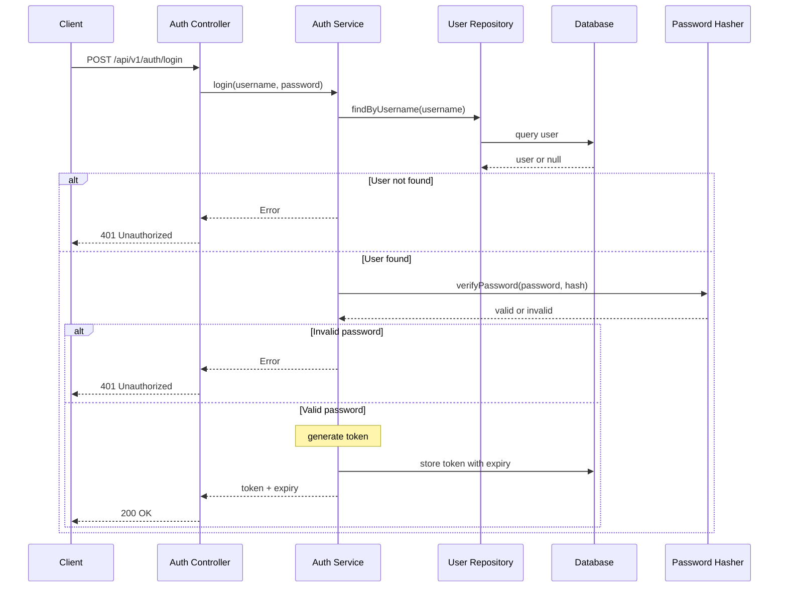
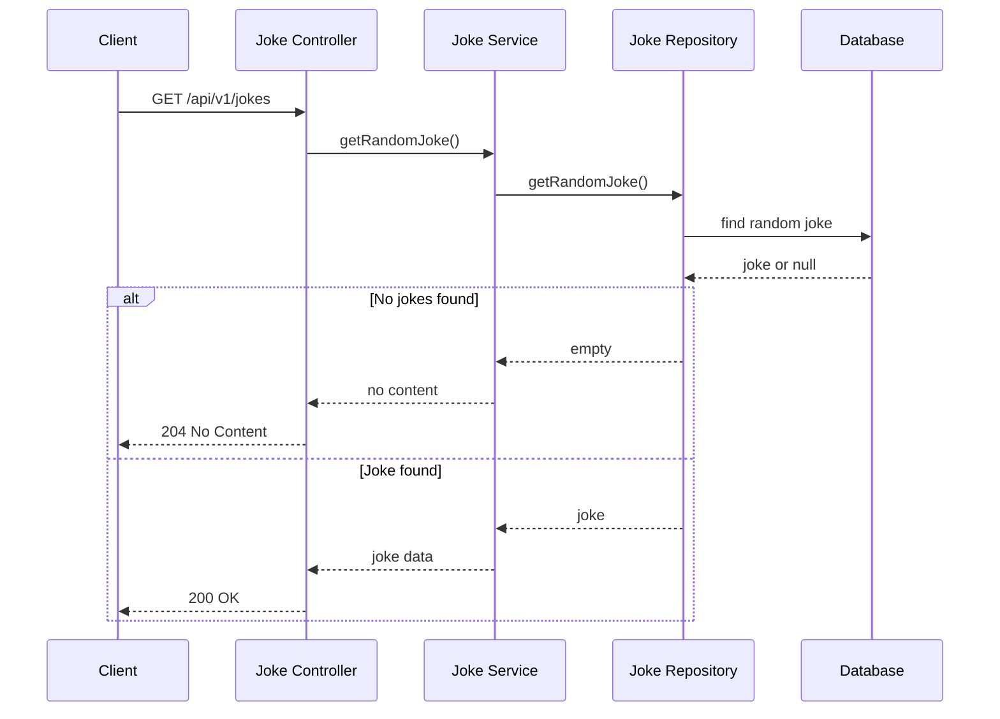
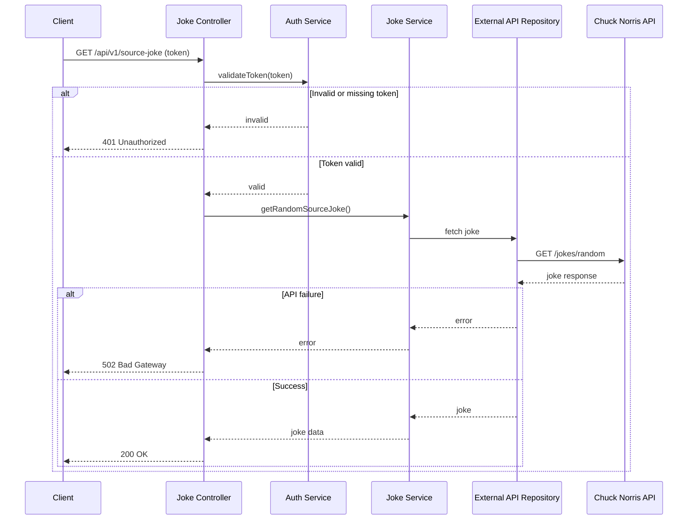
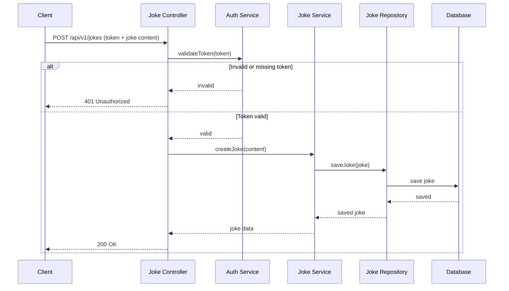

# 6. Runtime View

This chapter describes key runtime scenarios for the system.

## Sign-In Flow

The sign-in sequence is documented in the following sequence diagram. It shows alternative sequences for:
* entering a non-existing user name
* entering the wrong password and
* entering valid credentials

The user or administrator authenticates by submitting credentials. The system validates them against stored credentials using PBKDF2 password verification. On success, a token is generated and returned for use in subsequent requests.

## Fetch Random Joke (Public)

The sequence for fetching a random joke from the database is documented in the follwing sequence diagram. It shows two different scenarios:
* no joke found because database is empty (which is not an error technically, hence status code 204 instead of 404)
* return valid joke

Users fetch a random joke from the local database. No authentication is required. The backend queries the database and returns the joke content.

## Import Joke from External API (Admin)

The sequence for fetching a joke from the public API ("source joke") is documented in following diagram. It shows different scenarios:
* invalid or missing token
* API failure and
* success

Administrators import a joke from the external Chuck Norris API. The request includes an authorization token. The backend validates the token, fetches the joke from the external API, and maps the response.

## Create Joke (Admin)

The sequence for creatig a new joke is documented in the following sequence diagram. The two scenarios are:
* invalid or missing token and
* success

Administrators create a new joke directly. The request includes an authorization token and joke content. The backend validates the token and persists the joke to the database.
