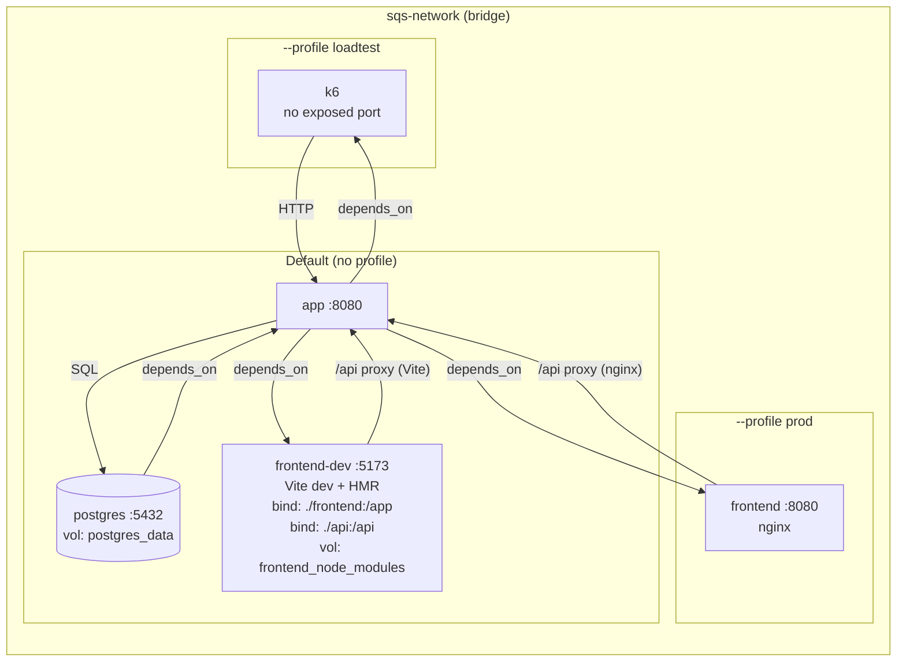

# 7. Deployment View

This view describes the current development setup only. No production deployment is planned at this stage.

## Infrastructure

All services run on a single Docker host, connected through a shared bridge network (`sqs-network`). Startup order is enforced via `depends_on: service_healthy`: PostgreSQL starts first, then the backend, then frontend and load-test services.

| Service        | Image / Build                      | Port (host:container)         | Profile    |
| -------------- | ---------------------------------- | ----------------------------- | ---------- |
| `postgres`     | `postgres:16-alpine`               | `${POSTGRES_PORT:-5432}:5432` |            |
| `app`          | `backend/Dockerfile` (Spring Boot) | `${BACKEND_PORT:-8080}:8080`  |            |
| `frontend-dev` | `frontend/Dockerfile` (Vite)       | `${FRONTEND_PORT:-5173}:5173` |            |
| `frontend`     | `frontend/Dockerfile` (nginx)      | `${FRONTEND_PORT:-5173}:8080` | `prod`     |
| `k6`           | `grafana/k6`                       |                               | `loadtest` |

`frontend-dev` starts by default (Vite dev server with hot reload). `frontend` replaces it under `--profile prod` (nginx serving pre-built static files). `k6` runs on-demand under `--profile loadtest`.

The only persistent volume is `postgres_data` for the database.

A diagram can be seen in [Chapter 5](05-building-blocks.md).

## Database

PostgreSQL 16 stores all persistent data. Schema changes are managed through Flyway migration scripts under version control, applied automatically on application startup.

## Environment Configuration

Configuration is managed through environment variables and Docker Compose. Non-secret values are stored in `.env`, which the starting scipt creates from `.env.example` for local runs. Sensitive values (database credentials, passwords) are injected through Docker Compose secrets at `/run/secrets/` and excluded from version control.

The default development stack uses file-backed Compose secrets from the project-local `.secrets/` directory. The `k6` load-test container, as an exception, cannot read those files. It is started only on demand through the `loadtest` profile and receives credentials through k6-specific Compose secrets so that it can run as a non-root user. The reasoning behind this distinction is documented in [ADR-10](adrs/adr-10-secrets-management.md).
