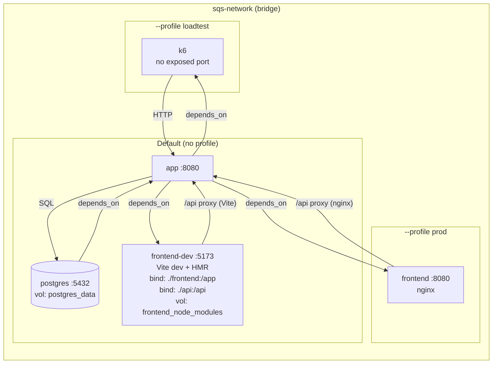

# 7. Deployment View

This view describes the current development setup only. No production deployment is planned at this stage.



## Infrastructure

All services run on a single Docker host, connected through a shared bridge network (`sqs-network`). Startup order is enforced via `depends_on: service_healthy`: PostgreSQL starts first, then the backend, then frontend and load-test services.

| Service        | Image / Build                      | Port (host:container)         | Profile    |
| -------------- | ---------------------------------- | ----------------------------- | ---------- |
| `postgres`     | `postgres:16-alpine`               | `${POSTGRES_PORT:-5432}:5432` | —          |
| `app`          | `backend/Dockerfile` (Spring Boot) | `${BACKEND_PORT:-8080}:8080`  | —          |
| `frontend-dev` | `frontend/Dockerfile` (Vite)       | `${FRONTEND_PORT:-5173}:5173` | —          |
| `frontend`     | `frontend/Dockerfile` (nginx)      | `${FRONTEND_PORT:-5173}:8080` | `prod`     |
| `k6`           | `grafana/k6`                       | —                             | `loadtest` |

`frontend-dev` starts by default (Vite dev server with hot reload). `frontend` replaces it under `--profile prod` (nginx serving pre-built static files). `k6` runs on-demand under `--profile loadtest`.

The only persistent volume is `postgres_data` for the database.

## Database

PostgreSQL 16 stores all persistent data. Schema changes are managed through Flyway migration scripts under version control, applied automatically on application startup.

## Environment Configuration

Configuration is managed through environment variables and Docker Compose. Sensitive values (database credentials, passwords) are injected via Docker secrets at `/run/secrets/` and excluded from version control.

## Local Credential Bootstrap

Local runtime configuration is split into non-secret configuration and secrets.

Non-secret configuration is stored in `.env`, which is created from `.env.example` by `start-application.sh` if it does not exist. It contains values such as service ports, database name, database user, and frontend API configuration.

Secrets are stored separately in the gitignored `.secrets/` directory. On first startup, `start-application.sh` creates the required secret files:

| File | Purpose |
| ---- | ------- |
| `.secrets/postgres_password` | PostgreSQL database password |
| `.secrets/app_seed_admin_username` | Initial backend seed admin username |
| `.secrets/app_seed_admin_password` | Initial backend seed admin password |

The backend imports Docker secrets through Spring Boot config tree support from `/run/secrets/`. PostgreSQL reads its password via `POSTGRES_PASSWORD_FILE`.

The startup script supports both interactive and non-interactive operation. In interactive mode, the user can accept the default seed admin username or enter a custom one. If no seed admin password is entered, the script generates one. In non-interactive mode (`--yes` or CI), all required values are generated automatically.

The backend validates the configured seed admin credentials on startup and creates or updates the seed admin user accordingly. The database migration layer is responsible for schema evolution only and does not seed hardcoded credentials.

For the architectural decisions behind this mechanism, see [ADR-09](adrs/adr-09-initial-user.md) and [ADR-10](adrs/adr-10-secrets-management.md).

## Load Test Secret Handling

The `k6` service runs only on demand through the `loadtest` profile and does not expose any port. It runs as a non-root user and receives credentials through k6-specific Docker Compose secrets.

The backend uses file-backed secrets from `.secrets/`. k6 uses environment-backed Compose secrets created by `run-loadtest.sh`. This avoids running k6 as root and avoids weakening the permissions of the persistent local secret files. The credentials are mounted into the k6 container as files under `/run/secrets/...` and are not passed as normal k6 container environment variables.

Load tests should be started through:

```bash
./run-loadtest.sh tests/baseline-test.js
```